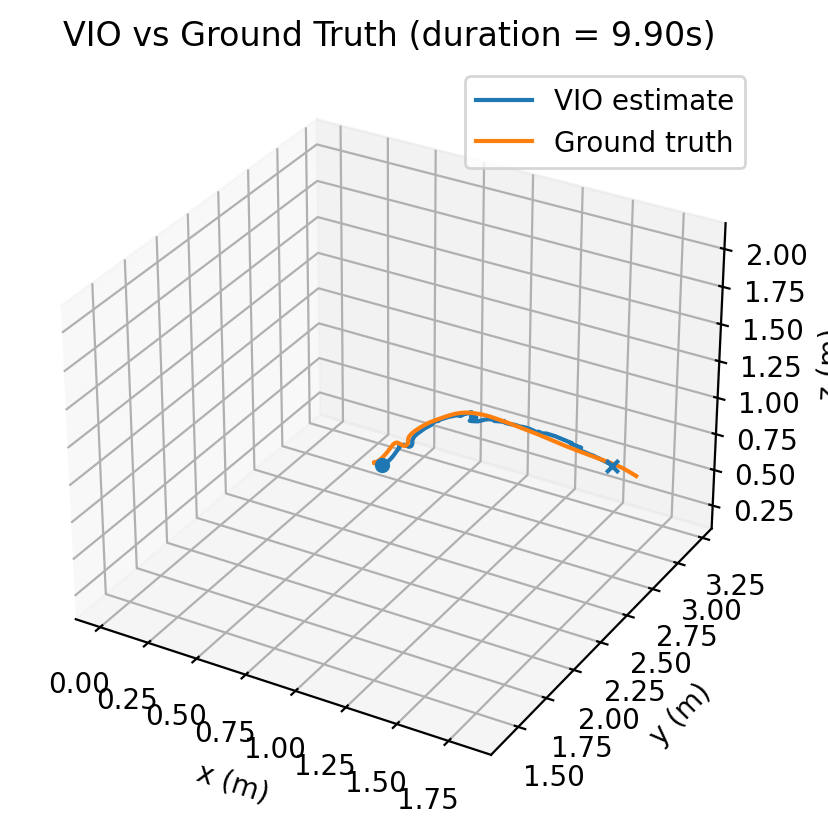
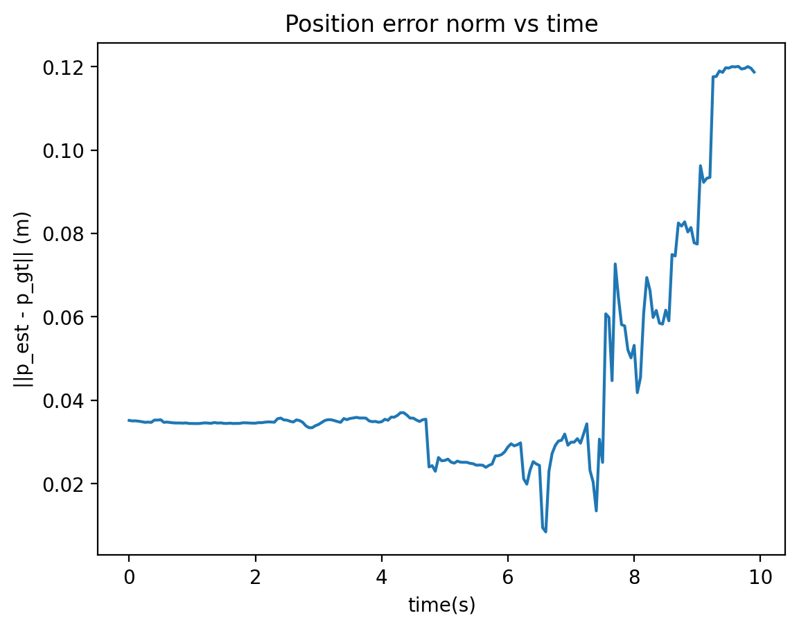

# Stereo–Inertial Visual Odometry (VIO) from Scratch

This repository contains an end-to-end stereo–inertial visual odometry (VIO) system implemented from scratch in Python and evaluated on the EuRoC MAV dataset.

The goal of this project is to demonstrate a deep understanding of visual–inertial estimation, spanning:

- raw sensor data handling,

- stereo geometry,

- IMU propagation,

- nonlinear optimization,

- estimator validation against ground truth.

This is not a wrapper around an existing VIO library.

## System Overview

The pipeline estimates the 6-DoF pose of a moving platform using:

- Stereo camera images (20 Hz)

- IMU measurements (200 Hz)

### High-level architecture

```text
EuRoC Dataset
├── IMU (accelerometer + gyroscope)
├── Stereo cameras (cam0, cam1)
│
↓
[ IMU Propagation ]
│
↓
[ Stereo Frontend ]
- FAST feature detection
- LK optical flow (temporal tracking)
- Stereo matching (rectified)
- Triangulation
│
↓
[ Pose-only Gauss-Newton Update ]
```
## Features Implemented
### Stereo Frontend

- FAST corner detection

- Lucas–Kanade optical flow (temporal tracking)

- Stereo rectification using calibration

- Stereo matching with disparity-guided initialization

- Rectified triangulation

- Track management and outlier rejection

### IMU Frontend

- Midpoint integration

- Gyroscope and accelerometer bias handling

- Gravity-aligned initialization from IMU averaging

### Estimation Backend

- Nonlinear pose-only Gauss–Newton optimization

- Robust loss (Huber weighting)

- Numeric Jacobians for measurement model

- Landmark management and pruning

### Validation & Analysis

- Evaluation on EuRoC MAV – Vicon Room

- Ground-truth comparison using Vicon motion capture

- Yaw gauge freedom analysis and alignment

- Position error and drift analysis

## Results (EuRoC V1_01_easy)
### Trajectory comparison (after yaw alignment)

- Estimated trajectory closely matches ground truth curvature and scale

- Dominant discrepancy is global yaw (unobservable in pure VIO)

<p align="center">  </p>

### Position error over time
<p align="center">  </p>

### Key metrics:

- Initial position error: ~3–4 cm

- Final position error (~10 s): ~12 cm

- Drift rate: ~1.2 cm/s

- No instability or divergence observed

This behavior is expected for VIO-only odometry without loop closure or EKF covariance propagation.

## Important Observations

- Yaw is unobservable in pure VIO and must be fixed by alignment or external reference

- Gravity-based initialization correctly estimates roll and pitch

- Drift accumulates gradually due to odometry-only operation

- Numeric Jacobians are sufficient for stable optimization at this scale

## Repository Structure
```text
vio_frontend/
├── core/
│   ├── state.py              # Nominal state definition
│   ├── propagation.py        # IMU midpoint integration
│   ├── imu_buffer.py
|   ├── init/
│       ├── gravity_init.py   # Initial orientation finding aligned with gravity
|   ├── stereo/               # FAST + LK stereo frontend, rectifier, tracking, triangulation
|   ├── vision/               # Gauss-Newton pose update, 
│       ├── update_gn.py 
│
├── frontend/                 
│   ├── vio_frontend.py        # Event-based orchestrator - IMU propagation, pose update
│
├── providers/
│   ├── euroc_provider.py     # EuRoC dataset reader
│
├── scripts/
│   ├── run_vio_frontend.py   # Main entry point
│   ├── euroc_sanity.py   # dataset sanity check
│   ├── sanity_rectify.py   # stereo rectification sanity check
│
├── results/
│   ├── vio_vs_ground_truth.png
│   ├── position_error_vs_time.png
│
└── README.md
```

## Running the Code
### Requirements

- Python 3.9+

- NumPy

- OpenCV

- Matplotlib

- SciPy

### Example
```text
python -m vio_frontend.scripts.run_vio_frontend
```
## Dataset

- EuRoC MAV Dataset

- Sequence: V1_01_easy

- Ground truth from Vicon motion capture

[https://projects.asl.ethz.ch/datasets/doku.php?id=kmavvisualinertialdatasets](https://projects.asl.ethz.ch/datasets/euroc-mav/)

## Limitations (By Design)

This project intentionally focuses on odometry, not full SLAM.

Not included:

- Loop closure

- Global map optimization

- EKF covariance propagation (planned extension)

- Magnetometer or GPS yaw fixing

## Planned Extensions

- EKF covariance propagation and update

- Estimator consistency analysis (NEES/NIS)

- Sliding-window bundle adjustment

- ROS2 integration for real-time visualization

## Motivation

This project was built to:

- deeply understand visual–inertial estimation

- bridge theory and real sensor data

- gain hands-on experience with nonlinear estimation pipelines

It complements a separate academic EKF-SLAM project with known landmarks by addressing raw-data, real-world challenges.
